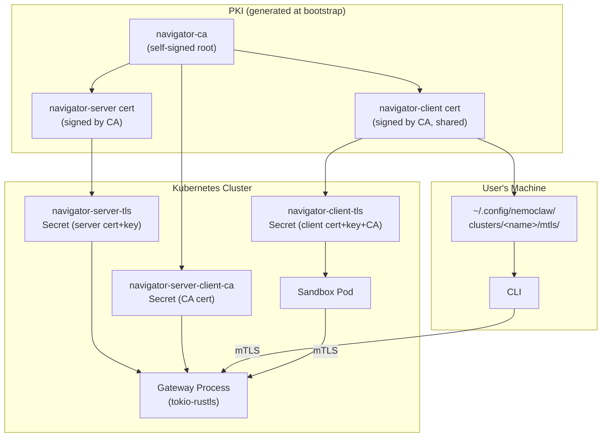
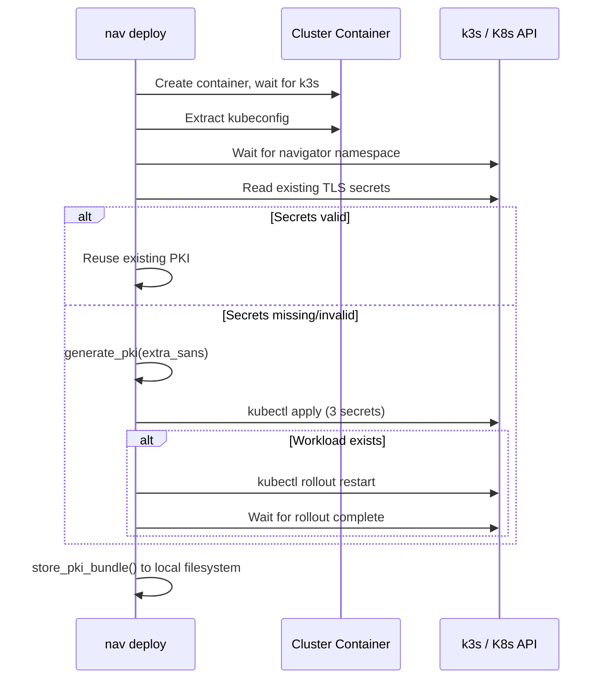
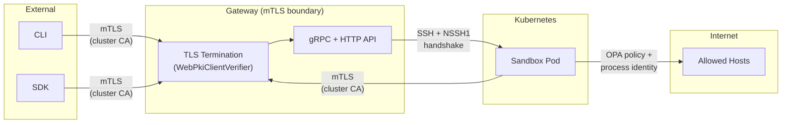

# Gateway Security

## Overview

All communication with the NemoClaw gateway is secured by mutual TLS (mTLS). Every client -- the CLI, SDK, and sandbox pods -- must present a valid certificate signed by the cluster CA to reach any gateway endpoint. There is no unauthenticated path; even health check endpoints are behind mTLS. The PKI is bootstrapped automatically during cluster deployment, and certificates are distributed to Kubernetes secrets and the local filesystem without manual configuration.

This document covers the certificate hierarchy, the bootstrap process, how mTLS is enforced at the gateway, how sandboxes and the CLI consume their certificates, and the broader security model of the gateway.

## Architecture Diagram



## Certificate Hierarchy

The PKI is a single-tier CA hierarchy generated by the `navigator-bootstrap` crate using `rcgen`. All certificates are created in a single pass at cluster bootstrap time.

```
navigator-ca  (Self-signed Root CA, O=navigator, CN=navigator-ca)
├── navigator-server  (Leaf cert, CN=navigator-server)
│   SANs: navigator, navigator.navigator.svc,
│          navigator.navigator.svc.cluster.local,
│          localhost, host.docker.internal, 127.0.0.1
│          + extra SANs for remote deployments
│
└── navigator-client  (Leaf cert, CN=navigator-client)
    Shared by the CLI and all sandbox pods.
```

Key design decisions:

- **Single client certificate**: One client cert is shared by the CLI and every sandbox pod. This simplifies secret management. Individual sandbox identity is not expressed at the TLS layer; post-authentication identification uses the `x-sandbox-id` gRPC header.
- **Long-lived certificates**: Certificates use `rcgen` defaults (validity ~1975--4096), which effectively never expire. This is appropriate for an internal dev-cluster PKI where certificates are ephemeral to the cluster's lifetime.
- **CA key not persisted**: The CA private key is used only during generation and is not stored in any Kubernetes secret. Re-signing requires regenerating the entire PKI.

See `crates/navigator-bootstrap/src/pki.rs:35` for the `generate_pki()` implementation and `crates/navigator-bootstrap/src/pki.rs:18` for the default SAN list.

## Kubernetes Secret Distribution

The PKI bundle is distributed as three Kubernetes secrets in the `navigator` namespace:

| Secret Name | Type | Contents | Consumed By |
|---|---|---|---|
| `navigator-server-tls` | `kubernetes.io/tls` | `tls.crt` (server cert), `tls.key` (server key) | Gateway StatefulSet |
| `navigator-server-client-ca` | `Opaque` | `ca.crt` (CA cert) | Gateway StatefulSet (client verification) |
| `navigator-client-tls` | `Opaque` | `tls.crt` (client cert), `tls.key` (client key), `ca.crt` (CA cert) | Sandbox pods, CLI (via local filesystem) |

Secret names are defined as constants in `crates/navigator-bootstrap/src/constants.rs:6-10`.

### Gateway Mounts

The Helm StatefulSet (`deploy/helm/navigator/templates/statefulset.yaml`) mounts:

| Volume | Mount Path | Source Secret |
|---|---|---|
| `tls-cert` | `/etc/navigator-tls/server/` (read-only) | `navigator-server-tls` |
| `tls-client-ca` | `/etc/navigator-tls/client-ca/` (read-only) | `navigator-server-client-ca` |

Environment variables point the gateway binary to these paths:

```
NEMOCLAW_TLS_CERT=/etc/navigator-tls/server/tls.crt
NEMOCLAW_TLS_KEY=/etc/navigator-tls/server/tls.key
NEMOCLAW_TLS_CLIENT_CA=/etc/navigator-tls/client-ca/ca.crt
```

### Sandbox Pod Mounts

When the gateway creates a sandbox pod (`crates/navigator-server/src/sandbox/mod.rs:681`), it injects:

- A volume backed by the `navigator-client-tls` secret.
- A read-only mount at `/etc/navigator-tls/client/` on the agent container.
- Environment variables for the sandbox gRPC client:

```
NEMOCLAW_TLS_CA=/etc/navigator-tls/client/ca.crt
NEMOCLAW_TLS_CERT=/etc/navigator-tls/client/tls.crt
NEMOCLAW_TLS_KEY=/etc/navigator-tls/client/tls.key
NEMOCLAW_ENDPOINT=https://navigator.navigator.svc.cluster.local:8080
```

### CLI Local Storage

The CLI's copy of the client certificate bundle is written to:

```
$XDG_CONFIG_HOME/nemoclaw/clusters/<cluster-name>/mtls/
├── ca.crt
├── tls.crt
└── tls.key
```

Files are written atomically using a temp-dir -> validate -> rename strategy with backup and rollback on failure. See `crates/navigator-bootstrap/src/mtls.rs:10`.

## PKI Bootstrap Sequence

PKI provisioning occurs during `deploy_cluster_with_logs()` (`crates/navigator-bootstrap/src/lib.rs:284`). The full sequence:

1. **Cluster container launched** -- a k3s container is created via Docker with a persistent volume.
2. **Kubeconfig extracted** -- the bootstrap waits for k3s readiness and retrieves the kubeconfig.
3. **Extra SANs computed** -- for remote deployments, the SSH destination hostname and its resolved IP are added to the server certificate's SANs. For local deployments, the detected gateway host (if any) is added.
4. **`reconcile_pki()` called** (`crates/navigator-bootstrap/src/lib.rs:515`):
   1. Wait for the `navigator` namespace to exist (created by the Helm controller).
   2. Attempt to load existing PKI from the three K8s secrets via `kubectl get secret` exec'd inside the container. Each field is base64-decoded and validated for PEM markers.
   3. **If secrets exist and are valid**: reuse them and return `rotated=false`.
   4. **If secrets are missing, incomplete, or malformed**: generate fresh PKI via `generate_pki()`, apply all three secrets via `kubectl apply`, and return `rotated=true`.
5. **Workload restart on rotation** -- if `rotated=true` and the navigator StatefulSet already exists, the bootstrap performs `kubectl rollout restart` and waits for completion. This ensures the server picks up new TLS secrets before the CLI writes its local copy.
6. **CLI-side credential storage** -- `store_pki_bundle()` writes `ca.crt`, `tls.crt`, `tls.key` to the local filesystem.



## Gateway TLS Enforcement

The gateway uses `tokio-rustls` to terminate TLS with mandatory client certificate verification. There is no plaintext fallback when TLS is configured.

### Server Configuration

`TlsAcceptor::from_files()` (`crates/navigator-server/src/tls.rs:27`) constructs the `rustls::ServerConfig`:

1. **Server identity**: loads the server certificate and private key from PEM files (supports PKCS#1, PKCS#8, and SEC1 key formats).
2. **Client verification**: builds a `WebPkiClientVerifier` from the CA certificate. This always requires clients to present a valid certificate; there is no optional-auth mode.
3. **ALPN**: advertises `h2` and `http/1.1` for protocol negotiation.

### Connection Flow

```
TCP accept
  → TLS handshake (client must present cert signed by cluster CA)
  → hyper auto-negotiates HTTP/1.1 or HTTP/2 via ALPN
  → MultiplexedService routes by content-type:
      ├── application/grpc → GrpcRouter
      └── other → Axum HTTP Router
```

All traffic shares a single port. The TLS handshake occurs before any HTTP parsing, so a client that fails mTLS verification never reaches any application handler.

### What Gets Rejected

The e2e test suite (`e2e/python/test_security_tls.py`) validates four scenarios:

| Scenario | Result |
|---|---|
| Client presents correct mTLS cert | `HEALTHY` response |
| Client trusts CA but presents no client cert | `UNAVAILABLE` -- handshake terminated |
| Client presents cert signed by a different CA | `UNAVAILABLE` -- handshake terminated |
| Client connects with plaintext (no TLS) | `UNAVAILABLE` -- transport failure |

## Sandbox-to-Gateway mTLS

Sandbox pods connect back to the gateway at startup to fetch their policy and provider credentials. The gRPC client (`crates/navigator-sandbox/src/grpc_client.rs:18`) reads three environment variables to configure mTLS:

| Env Var | Value |
|---|---|
| `NEMOCLAW_TLS_CA` | `/etc/navigator-tls/client/ca.crt` |
| `NEMOCLAW_TLS_CERT` | `/etc/navigator-tls/client/tls.crt` |
| `NEMOCLAW_TLS_KEY` | `/etc/navigator-tls/client/tls.key` |

These are used to build a `tonic::transport::ClientTlsConfig` with:
- `ca_certificate()` -- verifies the server's certificate against the cluster CA.
- `identity()` -- presents the shared client certificate for mTLS.

The sandbox calls two RPCs over this authenticated channel:
- `GetSandboxPolicy` -- fetches the YAML policy that governs the sandbox's behavior.
- `GetSandboxProviderEnvironment` -- fetches provider credentials as environment variables.

## SSH Tunnel Authentication

SSH connections into sandboxes pass through the gateway's HTTP CONNECT tunnel at `/connect/ssh`. This adds a second authentication layer on top of mTLS.

### Request Headers

| Header | Purpose |
|---|---|
| `x-sandbox-id` | Identifies the target sandbox |
| `x-sandbox-token` | Session token (created via `CreateSshSession` RPC) |

The gateway validates the token against the stored `SshSession` record, checks that it has not been revoked, and confirms the `sandbox_id` matches.

### NSSH1 Handshake

After the gateway connects to the sandbox pod's SSH port, it performs a cryptographic handshake:

```
NSSH1 <token> <timestamp> <nonce> <hmac_signature>\n
```

- **HMAC**: `HMAC-SHA256(secret, "{token}|{timestamp}|{nonce}")`, hex-encoded.
- **Secret**: shared via `NEMOCLAW_SSH_HANDSHAKE_SECRET` env var, set on both the gateway and sandbox.
- **Clock skew tolerance**: configurable via `NEMOCLAW_SSH_HANDSHAKE_SKEW_SECS` (default 300 seconds).
- **Expected response**: `OK\n` from the sandbox.

This handshake prevents direct connections to sandbox SSH ports from within the cluster, even from pods that share the network.

## Port Configuration

Traffic flows through several layers from the host to the gateway process:

| Layer | Port | Configurable Via |
|---|---|---|
| Host (Docker) | `8080` (default) | `--port` flag on `nav deploy` |
| Container | `30051` | Hardcoded in `crates/navigator-bootstrap/src/docker.rs` |
| k3s NodePort | `30051` | `deploy/helm/navigator/values.yaml` (`service.nodePort`) |
| k3s Service | `8080` | `deploy/helm/navigator/values.yaml` (`service.port`) |
| Server bind | `8080` | `--port` flag / `NEMOCLAW_SERVER_PORT` env var |

Docker maps `host_port → 30051/tcp`. Inside k3s, the NodePort service maps `30051 → 8080 (pod port)`. The server binds `0.0.0.0:8080`.

## Security Model Summary

### Trust Boundaries



### What Is Authenticated

| Boundary | Mechanism |
|---|---|
| External → Gateway | mTLS with cluster CA (`WebPkiClientVerifier`) |
| Sandbox → Gateway | mTLS with shared client cert |
| Gateway → Sandbox (SSH) | Session token + HMAC-SHA256 handshake (NSSH1) |
| Sandbox → External (network) | OPA policy + process identity binding via `/proc` |

### What Is Not Authenticated (by Design)

- **Individual sandbox identity at the TLS layer**: all sandboxes share one client certificate (`CN=navigator-client`). Post-TLS identification uses the `x-sandbox-id` gRPC metadata header, which is trusted because it arrives over an mTLS-authenticated channel.
- **Health endpoints**: `/health`, `/healthz`, and `/readyz` are behind mTLS like all other endpoints. There is no unauthenticated health check path.

### Gateway Security Context

The gateway container runs with a hardened security context (`deploy/helm/navigator/values.yaml:25`):

```yaml
securityContext:
  runAsNonRoot: true
  runAsUser: 1000
  allowPrivilegeEscalation: false
  capabilities:
    drop:
      - ALL
```

The gateway process has no elevated privileges and drops all Linux capabilities.

## Threat Model

This section defines the primary attacker profiles, what the current design protects, and where residual risk remains.

### Security Goals

- Prevent unauthenticated access to gateway APIs and SSH tunneling.
- Prevent unauthorized sandbox access across tenants/sessions.
- Protect sandbox-to-gateway policy and credential exchange in transit.
- Limit impact from network-level attackers and accidental misconfiguration.

### In Scope Threat Actors

| Threat Actor | Example Capability |
|---|---|
| Network attacker | Can observe/modify traffic between clients and gateway |
| Unauthorized external client | Can reach gateway port but has no valid client cert |
| Compromised sandbox workload | Has code execution inside one sandbox pod |
| Malicious in-cluster pod | Can attempt direct pod-to-pod connections |
| Stolen CLI credentials | Has copied `ca.crt`/`tls.crt`/`tls.key` from a developer machine |

### Primary Defenses

| Threat | Existing Defense | Notes |
|---|---|---|
| MITM or passive interception of gateway traffic | Mandatory mTLS with cluster CA | Handshake fails without trusted cert chain |
| Unauthenticated API/health access | No plaintext or unauthenticated endpoint path | `/health*` endpoints remain behind mTLS |
| Forged SSH tunnel connection to sandbox | Session token validation + NSSH1 HMAC handshake | Requires token and shared handshake secret |
| Direct access to sandbox SSH port from cluster peers | NSSH1 challenge-response | Connection denied without valid signature |
| Unauthorized outbound internet access from sandbox | OPA policy + process identity checks | Applies to sandbox egress policy layer |

### Residual Risks and Current Tradeoffs

| Risk | Why It Exists |
|---|---|
| No per-sandbox TLS identity | All sandboxes and CLI share one client certificate |
| Broad blast radius on key compromise | Shared client key reuse across multiple components |
| Weak cryptoperiod | Certificates are effectively non-expiring by default |
| Limited fine-grained revocation | CA private key is not persisted; rotation is coarse-grained |
| Local credential theft risk | CLI mTLS key material is stored on developer filesystem |

### Out of Scope / Not Defended By This Layer

- A fully compromised Kubernetes control plane or cluster-admin account.
- A malicious actor with direct access to Kubernetes secrets in the `navigator` namespace.
- Host-level compromise of the developer workstation running the CLI.
- Application-layer authorization bugs after mTLS authentication succeeds.

### Trust Assumptions

- The cluster CA is generated and distributed without interception during bootstrap.
- Kubernetes secret access is restricted to intended workloads and operators.
- Gateway and sandbox container images are trusted and not tampered with.
- System clocks are reasonably synchronized for timestamp-based SSH handshake checks.

## Sandbox Outbound TLS (L7 Inspection)

Separate from the cluster mTLS infrastructure, each sandbox has an independent TLS capability for inspecting outbound HTTPS traffic. This is documented here for completeness because it involves a distinct, per-sandbox PKI.

When a sandbox policy configures `tls: terminate` on an endpoint, the sandbox proxy performs TLS man-in-the-middle inspection:

1. **Ephemeral sandbox CA**: a per-sandbox CA (`CN=Navigator Sandbox CA, O=Navigator`) is generated at sandbox startup. This CA is completely independent of the cluster mTLS CA.
2. **Trust injection**: the sandbox CA is written to the sandbox filesystem and injected via `NODE_EXTRA_CA_CERTS` and `SSL_CERT_FILE` so processes inside the sandbox trust it.
3. **Dynamic leaf certs**: for each target hostname, the proxy generates and caches a leaf certificate signed by the sandbox CA (up to 256 entries).
4. **Upstream verification**: the proxy verifies upstream server certificates against Mozilla root CAs (`webpki-roots`), not against the cluster CA.

This capability is orthogonal to gateway mTLS -- it operates only on sandbox-to-internet traffic and uses entirely separate key material. See [Policy Language](security-policy.md) for configuration details.

## Cross-References

- [Gateway Architecture](gateway.md) -- protocol multiplexing, gRPC services, persistence, and SSH tunneling
- [Cluster Bootstrap](cluster-single-node.md) -- cluster provisioning, Docker container lifecycle, and credential management
- [Sandbox Architecture](sandbox.md) -- sandbox-side isolation, proxy, and policy enforcement
- [Sandbox Connect](sandbox-connect.md) -- client-side SSH connection flow through the gateway
- [Policy Language](security-policy.md) -- YAML/Rego policy system including L7 TLS inspection configuration
