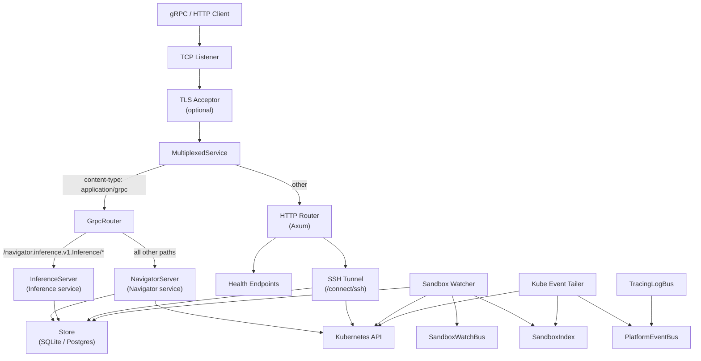
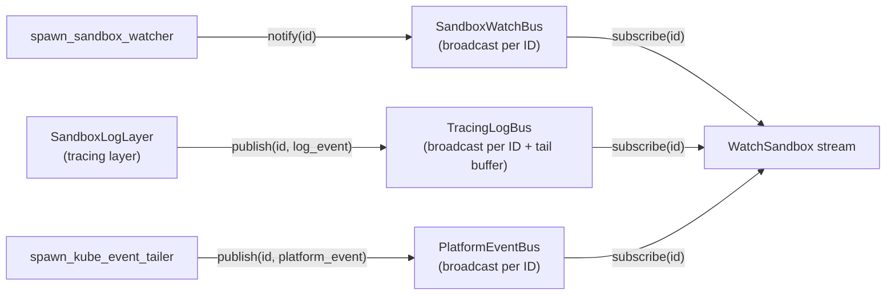

# Gateway Architecture

## Overview

`navigator-server` is the gateway -- the central control plane for a cluster. It exposes two gRPC services (Navigator and Inference) and HTTP endpoints on a single multiplexed port, manages sandbox lifecycle through Kubernetes CRDs, persists state in SQLite or Postgres, and provides SSH tunneling into sandbox pods. The gateway coordinates all interactions between clients, the Kubernetes cluster, and the persistence layer.

## Architecture Diagram

The following diagram shows the major components inside the gateway process and their relationships.



## Source Layout

| Module | File | Purpose |
|--------|------|---------|
| Entry point | `crates/navigator-server/src/main.rs` | CLI argument parsing, config assembly, tracing setup, calls `run_server` |
| Gateway runtime | `crates/navigator-server/src/lib.rs` | `ServerState` struct, `run_server()` accept loop |
| Protocol mux | `crates/navigator-server/src/multiplex.rs` | `MultiplexService`, `MultiplexedService`, `GrpcRouter`, `BoxBody` |
| gRPC: Navigator | `crates/navigator-server/src/grpc.rs` | `NavigatorService` -- sandbox CRUD, provider CRUD, watch, exec, SSH sessions, policy delivery |
| gRPC: Inference | `crates/navigator-server/src/inference.rs` | `InferenceService` -- inference route CRUD and sandbox inference bundle delivery |
| HTTP | `crates/navigator-server/src/http.rs` | Health endpoints, merged with SSH tunnel router |
| SSH tunnel | `crates/navigator-server/src/ssh_tunnel.rs` | HTTP CONNECT handler at `/connect/ssh` |
| TLS | `crates/navigator-server/src/tls.rs` | `TlsAcceptor` wrapping rustls with ALPN |
| Persistence | `crates/navigator-server/src/persistence/mod.rs` | `Store` enum (SQLite/Postgres), generic object CRUD, protobuf codec |
| Persistence: SQLite | `crates/navigator-server/src/persistence/sqlite.rs` | `SqliteStore` with sqlx |
| Persistence: Postgres | `crates/navigator-server/src/persistence/postgres.rs` | `PostgresStore` with sqlx |
| Sandbox K8s | `crates/navigator-server/src/sandbox/mod.rs` | `SandboxClient`, CRD creation/deletion, Kubernetes watcher, phase derivation |
| Sandbox index | `crates/navigator-server/src/sandbox_index.rs` | `SandboxIndex` -- in-memory name/pod-to-id correlation |
| Watch bus | `crates/navigator-server/src/sandbox_watch.rs` | `SandboxWatchBus`, `PlatformEventBus`, Kubernetes event tailer |
| Tracing bus | `crates/navigator-server/src/tracing_bus.rs` | `TracingLogBus` -- captures tracing events keyed by `sandbox_id` |

Proto definitions consumed by the gateway:

| Proto file | Package | Defines |
|------------|---------|---------|
| `proto/navigator.proto` | `navigator.v1` | `Navigator` service, sandbox/provider/SSH/watch messages |
| `proto/inference.proto` | `navigator.inference.v1` | `Inference` service, route CRUD messages, `GetSandboxInferenceBundle` |
| `proto/datamodel.proto` | `navigator.datamodel.v1` | `Sandbox`, `SandboxSpec`, `SandboxStatus`, `Provider`, `SandboxPhase` |
| `proto/sandbox.proto` | `navigator.sandbox.v1` | `SandboxPolicy`, `NetworkPolicyRule`, `InferencePolicy` |

## Startup Sequence

The gateway boots in `main()` (`crates/navigator-server/src/main.rs`) and proceeds through these steps:

1. **Install rustls crypto provider** -- `aws_lc_rs::default_provider().install_default()`.
2. **Parse CLI arguments** -- `Args::parse()` via `clap`. Every flag has a corresponding environment variable (see [Configuration](#configuration)).
3. **Initialize tracing** -- Creates a `TracingLogBus` and installs a tracing subscriber that writes to stdout and publishes log events keyed by `sandbox_id` into the bus.
4. **Build `Config`** -- Assembles a `navigator_core::Config` from the parsed arguments.
5. **Call `run_server()`** (`crates/navigator-server/src/lib.rs`):
   1. Connect to the persistence store (`Store::connect`), which auto-detects SQLite vs Postgres from the URL prefix and runs migrations.
   2. Create `SandboxClient` (initializes a `kube::Client` from in-cluster or kubeconfig).
   3. Build `ServerState` (shared via `Arc<ServerState>` across all handlers).
   4. **Spawn background tasks**:
      - `spawn_sandbox_watcher` -- watches Kubernetes Sandbox CRDs and syncs state to the store.
      - `spawn_kube_event_tailer` -- watches Kubernetes Events in the sandbox namespace and publishes them to the `PlatformEventBus`.
   5. Create `MultiplexService`.
   6. Bind `TcpListener` on `config.bind_address`.
   7. Optionally create `TlsAcceptor` from cert/key files.
   8. Enter the accept loop: for each connection, spawn a tokio task that optionally performs a TLS handshake, then calls `MultiplexService::serve()`.

## Configuration

All configuration is via CLI flags with environment variable fallbacks. The `--db-url` flag is the only required argument.

| Flag | Env Var | Default | Description |
|------|---------|---------|-------------|
| `--port` | `NEMOCLAW_SERVER_PORT` | `8080` | TCP listen port (binds `0.0.0.0`) |
| `--log-level` | `NEMOCLAW_LOG_LEVEL` | `info` | Tracing log level filter |
| `--tls-cert` | `NEMOCLAW_TLS_CERT` | None | Path to PEM certificate file |
| `--tls-key` | `NEMOCLAW_TLS_KEY` | None | Path to PEM private key file |
| `--tls-client-ca` | `NEMOCLAW_TLS_CLIENT_CA` | None | Path to PEM CA cert for mTLS client verification |
| `--client-tls-secret-name` | `NEMOCLAW_CLIENT_TLS_SECRET_NAME` | None | K8s secret name to mount into sandbox pods for mTLS |
| `--db-url` | `NEMOCLAW_DB_URL` | *required* | Database URL (`sqlite:...` or `postgres://...`). The Helm chart defaults to `sqlite:/var/navigator/navigator.db` (persistent volume). In-memory SQLite (`sqlite::memory:?cache=shared`) works for ephemeral/test environments but data is lost on restart. |
| `--sandbox-namespace` | `NEMOCLAW_SANDBOX_NAMESPACE` | `default` | Kubernetes namespace for sandbox CRDs |
| `--sandbox-image` | `NEMOCLAW_SANDBOX_IMAGE` | None | Default container image for sandbox pods |
| `--grpc-endpoint` | `NEMOCLAW_GRPC_ENDPOINT` | None | gRPC endpoint reachable from within the cluster (for sandbox callbacks) |
| `--ssh-gateway-host` | `NEMOCLAW_SSH_GATEWAY_HOST` | `127.0.0.1` | Public hostname returned in SSH session responses |
| `--ssh-gateway-port` | `NEMOCLAW_SSH_GATEWAY_PORT` | `8080` | Public port returned in SSH session responses |
| `--ssh-connect-path` | `NEMOCLAW_SSH_CONNECT_PATH` | `/connect/ssh` | HTTP path for SSH CONNECT/upgrade |
| `--sandbox-ssh-port` | `NEMOCLAW_SANDBOX_SSH_PORT` | `2222` | SSH listen port inside sandbox pods |
| `--ssh-handshake-secret` | `NEMOCLAW_SSH_HANDSHAKE_SECRET` | None | Shared HMAC-SHA256 secret for gateway-to-sandbox handshake |
| `--ssh-handshake-skew-secs` | `NEMOCLAW_SSH_HANDSHAKE_SKEW_SECS` | `300` | Allowed clock skew (seconds) for SSH handshake timestamps |

## Shared State

All handlers share an `Arc<ServerState>` (`crates/navigator-server/src/lib.rs`):

```rust
pub struct ServerState {
    pub config: Config,
    pub store: Arc<Store>,
    pub sandbox_client: SandboxClient,
    pub sandbox_index: SandboxIndex,
    pub sandbox_watch_bus: SandboxWatchBus,
    pub tracing_log_bus: TracingLogBus,
}
```

- **`store`** -- persistence backend (SQLite or Postgres) for all object types.
- **`sandbox_client`** -- Kubernetes client scoped to the sandbox namespace; creates/deletes CRDs and resolves pod IPs.
- **`sandbox_index`** -- in-memory bidirectional index mapping sandbox names and agent pod names to sandbox IDs. Used by the event tailer to correlate Kubernetes events.
- **`sandbox_watch_bus`** -- `broadcast`-based notification bus keyed by sandbox ID. Producers call `notify(&id)` when the persisted sandbox record changes; consumers in `WatchSandbox` streams receive `()` signals and re-read the record.
- **`tracing_log_bus`** -- captures `tracing` events that include a `sandbox_id` field and republishes them as `SandboxLogLine` messages. Maintains a per-sandbox tail buffer (default 200 entries). Also contains a nested `PlatformEventBus` for Kubernetes events.

## Protocol Multiplexing

All traffic (gRPC and HTTP) shares a single TCP port. Multiplexing happens at the request level, not the connection level.

### Connection Handling

`MultiplexService::serve()` (`crates/navigator-server/src/multiplex.rs`) creates per-connection service instances:

1. Each accepted TCP stream (optionally TLS-wrapped) is passed to `hyper_util::server::conn::auto::Builder`, which auto-negotiates HTTP/1.1 or HTTP/2.
2. The builder calls `serve_connection_with_upgrades()`, which supports HTTP upgrades (needed for the SSH tunnel's CONNECT method).
3. For each request, `MultiplexedService` inspects the `content-type` header:
   - **Starts with `application/grpc`** -- routes to `GrpcRouter`.
   - **Anything else** -- routes to the Axum HTTP router.

### gRPC Sub-Routing

`GrpcRouter` (`crates/navigator-server/src/multiplex.rs`) further routes gRPC requests by URI path prefix:

- Paths starting with `/navigator.inference.v1.Inference/` go to `InferenceServer`.
- All other gRPC paths go to `NavigatorServer`.

### Body Type Normalization

Both gRPC and HTTP handlers produce different response body types. `MultiplexedService` normalizes them through a custom `BoxBody` wrapper (an `UnsyncBoxBody<Bytes, Box<dyn Error>>`) so that Hyper receives a uniform response type.

### TLS + mTLS

When TLS is enabled (`crates/navigator-server/src/tls.rs`):

- `TlsAcceptor::from_files()` loads PEM certificates and keys via `rustls_pemfile`, builds a `rustls::ServerConfig`, and configures ALPN to advertise `h2` and `http/1.1`.
- When a client CA path is provided (`--tls-client-ca`), the server enforces mutual TLS using `WebPkiClientVerifier` -- all clients must present a certificate signed by the cluster CA. Without a client CA path, the server falls back to `with_no_client_auth()` (for local dev).
- Supports PKCS#1, PKCS#8, and SEC1 private key formats.
- The TLS handshake happens before the stream reaches Hyper's auto builder, so ALPN negotiation and HTTP version detection work together transparently.
- Certificates are generated at cluster bootstrap time by the `navigator-bootstrap` crate using `rcgen`, not by a Helm Job. The bootstrap reconciles three K8s secrets: `navigator-server-tls` (server cert+key), `navigator-server-client-ca` (CA cert), and `navigator-client-tls` (client cert+key+CA, shared by CLI and sandbox pods).
- **Certificate lifetime**: Certificates use `rcgen` defaults (effectively never expire), which is appropriate for an internal dev-cluster PKI where certs are ephemeral to the cluster's lifetime.
- **Redeploy behavior**: On redeploy, existing cluster TLS secrets are loaded and reused if they are complete and valid PEM. If secrets are missing, incomplete, or malformed, fresh PKI is generated. If rotation occurs and the navigator workload is already running, the bootstrap performs a rollout restart and waits for completion before persisting CLI-side credentials.

## gRPC Services

### Navigator Service

Defined in `proto/navigator.proto`, implemented in `crates/navigator-server/src/grpc.rs` as `NavigatorService`.

#### Sandbox Management

| RPC | Description | Key behavior |
|-----|-------------|--------------|
| `Health` | Returns service status and version | Always returns `HEALTHY` with `CARGO_PKG_VERSION` |
| `CreateSandbox` | Create a new sandbox | Validates spec and policy, validates provider names exist (fail-fast), persists to store, creates Kubernetes CRD. On K8s 409 conflict or error, rolls back the store record and index entry. |
| `GetSandbox` | Fetch sandbox by name | Looks up by name via `store.get_message_by_name()` |
| `ListSandboxes` | List sandboxes | Paginated (default limit 100), decodes protobuf payloads from store records |
| `DeleteSandbox` | Delete sandbox by name | Sets phase to `Deleting`, persists, notifies watch bus, then deletes the Kubernetes CRD. Cleans up store if the CRD was already gone. |
| `WatchSandbox` | Stream sandbox updates | Server-streaming RPC. See [Watch Sandbox Stream](#watch-sandbox-stream) below. |
| `ExecSandbox` | Execute command in sandbox | Server-streaming RPC. See [Remote Exec via SSH](#remote-exec-via-ssh) below. |

#### SSH Session Management

| RPC | Description |
|-----|-------------|
| `CreateSshSession` | Creates a session token for a `Ready` sandbox. Persists an `SshSession` record and returns gateway connection details (host, port, scheme, connect path). |
| `RevokeSshSession` | Marks a session as revoked by setting `session.revoked = true` in the store. |

#### Provider Management

Full CRUD for `Provider` objects, which store typed credentials (e.g., API keys for Claude, GitLab tokens).

| RPC | Description |
|-----|-------------|
| `CreateProvider` | Creates a provider. Requires `type` field; auto-generates a 6-char name if not provided. Rejects duplicates by name. |
| `GetProvider` | Fetches a provider by name. |
| `ListProviders` | Paginated list (default limit 100). |
| `UpdateProvider` | Updates an existing provider by name. Preserves the stored `id` and `name`; replaces `type`, `credentials`, and `config`. |
| `DeleteProvider` | Deletes a provider by name. Returns `deleted: true/false`. |

#### Policy and Provider Environment Delivery

These RPCs are called by sandbox pods at startup to bootstrap themselves.

| RPC | Description |
|-----|-------------|
| `GetSandboxPolicy` | Returns the `SandboxPolicy` from a sandbox's spec, looked up by sandbox ID. |
| `GetSandboxProviderEnvironment` | Resolves provider credentials into environment variables for a sandbox. Iterates the sandbox's `spec.providers` list, fetches each `Provider`, and collects credential key-value pairs. First provider wins on duplicate keys. Skips credential keys that do not match `^[A-Za-z_][A-Za-z0-9_]*$`. |

### Inference Service

Defined in `proto/inference.proto`, implemented in `crates/navigator-server/src/inference.rs` as `InferenceService`.

The gateway acts as the control plane for inference routes. It stores route definitions, enforces sandbox-scoped access policies, and delivers pre-filtered route bundles to sandbox pods. The gateway does not execute inference requests -- sandboxes connect directly to inference backends using the credentials and endpoints provided in the bundle.

#### Route Delivery

| RPC | Description |
|-----|-------------|
| `GetSandboxInferenceBundle` | Returns the set of inference routes a sandbox is authorized to use. Takes a `sandbox_id`, loads the sandbox's `InferencePolicy.allowed_routes`, fetches all enabled `InferenceRoute` records whose `routing_hint` matches, normalizes protocols, and returns them as `SandboxResolvedRoute` messages along with a revision hash and `generated_at_ms` timestamp. |

The trait method delegates to the standalone function `resolve_sandbox_inference_bundle(store, sandbox_id)` (`crates/navigator-server/src/inference.rs`), which takes `&Store` and `&str` instead of `&self`. This extraction decouples bundle resolution from `ServerState`, enabling direct unit testing against an in-memory SQLite store without constructing a full server. The function similarly delegates route filtering to `list_sandbox_routes(store, allowed_routes)`.

The `GetSandboxInferenceBundleResponse` includes:

- **`routes`** -- a list of `SandboxResolvedRoute` messages, each containing `routing_hint`, `base_url`, `model_id`, `api_key`, and normalized `protocols`. These are flattened from `InferenceRoute.spec` -- no route IDs or names are exposed to the sandbox.
- **`revision`** -- a hex-encoded hash computed from the route contents (`routing_hint`, `base_url`, `model_id`, `api_key`, `protocols`). Sandboxes can compare this value to detect when their route set has changed.
- **`generated_at_ms`** -- epoch milliseconds when the bundle was assembled.

Route filtering in `list_sandbox_routes()` (`crates/navigator-server/src/inference.rs`):
1. Load the sandbox's `InferencePolicy.allowed_routes` into a `HashSet`.
2. Fetch all `InferenceRoute` records from the store (up to 500).
3. Skip routes where `enabled == false`.
4. Skip routes whose `routing_hint` is not in the allowed set.
5. Normalize protocols via `navigator_core::inference::normalize_protocols()` and skip routes with no valid protocols after normalization.

#### Route CRUD

| RPC | Description |
|-----|-------------|
| `CreateInferenceRoute` | Creates a route. Normalizes protocols (lowercase + dedupe), validates required fields (`routing_hint`, `base_url`, `protocols`, `model_id`). Auto-generates a 6-char name if empty. Rejects duplicates by name. |
| `UpdateInferenceRoute` | Updates a route by name. Preserves stored `id`. Normalizes protocols and validates the spec. |
| `DeleteInferenceRoute` | Deletes a route by name. Returns `deleted: bool`. |
| `ListInferenceRoutes` | Paginated list (default limit 100). |

## HTTP Endpoints

The HTTP router (`crates/navigator-server/src/http.rs`) merges two sub-routers:

### Health Endpoints

| Path | Method | Response |
|------|--------|----------|
| `/health` | GET | `200 OK` (empty body) |
| `/healthz` | GET | `200 OK` (empty body) -- Kubernetes liveness probe |
| `/readyz` | GET | `200 OK` with JSON `{"status": "healthy", "version": "<version>"}` -- Kubernetes readiness probe |

### SSH Tunnel Endpoint

| Path | Method | Response |
|------|--------|----------|
| `/connect/ssh` | CONNECT | Upgrades the connection to a bidirectional TCP tunnel to a sandbox pod's SSH port |

See [SSH Tunnel Gateway](#ssh-tunnel-gateway) for details.

## Watch Sandbox Stream

The `WatchSandbox` RPC (`crates/navigator-server/src/grpc.rs`) provides a multiplexed server-streaming response that can include sandbox status snapshots, gateway log lines, and platform events.

### Request Options

The `WatchSandboxRequest` controls what the stream includes:

- `follow_status` -- subscribe to `SandboxWatchBus` notifications and re-read the sandbox record on each change.
- `follow_logs` -- subscribe to `TracingLogBus` for gateway log lines correlated by `sandbox_id`.
- `follow_events` -- subscribe to `PlatformEventBus` for Kubernetes events correlated to the sandbox.
- `log_tail_lines` -- replay the last N log lines before following (default 200).
- `stop_on_terminal` -- end the stream when the sandbox reaches the `Ready` phase. Note: `Error` phase does not stop the stream because it may be transient (e.g., `ReconcilerError`).

### Stream Protocol

1. Subscribe to all requested buses **before** reading the initial snapshot (prevents missed notifications).
2. Send the current sandbox record as the first event.
3. If `stop_on_terminal` is set and the sandbox is already `Ready`, end the stream immediately.
4. Replay tail logs if `follow_logs` is enabled.
5. Enter a `tokio::select!` loop listening on up to three broadcast receivers:
   - **Status updates**: re-read the sandbox from the store, send the snapshot, check for terminal phase.
   - **Log lines**: forward `SandboxStreamEvent::Log` messages.
   - **Platform events**: forward `SandboxStreamEvent::Event` messages.

### Event Bus Architecture



All buses use `tokio::sync::broadcast` channels keyed by sandbox ID. Buffer sizes:
- `SandboxWatchBus`: 128 (signals only, no payload -- just `()`)
- `TracingLogBus`: 1024 (full `SandboxStreamEvent` payloads)
- `PlatformEventBus`: 1024 (full `SandboxStreamEvent` payloads)

Broadcast lag is translated to `Status::resource_exhausted` via `broadcast_to_status()`.

## Remote Exec via SSH

The `ExecSandbox` RPC (`crates/navigator-server/src/grpc.rs`) executes a command inside a sandbox pod over SSH and streams stdout/stderr/exit back to the client.

### Execution Flow

1. Validate request: `sandbox_id`, `command`, and environment key format (`^[A-Za-z_][A-Za-z0-9_]*$`).
2. Verify sandbox exists and is in `Ready` phase.
3. Resolve target: prefer agent pod IP (via `sandbox_client.agent_pod_ip()`), fall back to Kubernetes service DNS (`<name>.<namespace>.svc.cluster.local`).
4. Build the remote command string: sort environment variables, shell-escape all values, prepend `cd <workdir> &&` if `workdir` is set.
5. **Start a single-use SSH proxy**: binds an ephemeral local TCP port, accepts one connection, performs the NSSH1 handshake with the sandbox, and bidirectionally copies data.
6. **Connect via `russh`**: establishes an SSH connection through the local proxy, authenticates with `none` auth as user `sandbox`, opens a session channel, and executes the command.
7. Stream `ExecSandboxStdout`, `ExecSandboxStderr` chunks as they arrive, then send `ExecSandboxExit` with the exit code.
8. On timeout (if `timeout_seconds > 0`), send exit code 124 (matching the `timeout(1)` convention).

### NSSH1 Handshake Protocol

The single-use SSH proxy and the SSH tunnel endpoint both use the same handshake:

```
NSSH1 <token> <timestamp> <nonce> <hmac_signature>\n
```

- `token` -- session token or a one-time UUID.
- `timestamp` -- Unix epoch seconds.
- `nonce` -- UUID v4.
- `hmac_signature` -- `HMAC-SHA256(secret, "{token}|{timestamp}|{nonce}")`, hex-encoded.
- Expected response: `OK\n` from the sandbox.

The `ssh_handshake_skew_secs` configuration controls how much clock skew is tolerated.

## SSH Tunnel Gateway

The SSH tunnel endpoint (`crates/navigator-server/src/ssh_tunnel.rs`) allows external SSH clients to reach sandbox pods through the gateway using HTTP CONNECT upgrades.

### Request Flow

1. Client sends `CONNECT /connect/ssh` with headers `x-sandbox-id` and `x-sandbox-token`.
2. Handler validates the method is CONNECT, extracts headers.
3. Fetches the `SshSession` from the store by token; rejects if revoked or if `sandbox_id` does not match.
4. Fetches the `Sandbox`; rejects if not in `Ready` phase.
5. Resolves the connect target: agent pod IP if available, otherwise Kubernetes service DNS.
6. Returns `200 OK`, then upgrades the connection via `hyper::upgrade::on()`.
7. In a spawned task: connects to the sandbox's SSH port, performs the NSSH1 handshake, then bidirectionally copies bytes between the upgraded HTTP connection and the sandbox TCP stream.
8. On completion, gracefully shuts down the write-half of the upgraded connection for clean EOF handling.

## Persistence Layer

### Store Architecture

The `Store` enum (`crates/navigator-server/src/persistence/mod.rs`) dispatches to either `SqliteStore` or `PostgresStore` based on the database URL prefix:

- `sqlite:*` -- uses `sqlx::SqlitePool` (1 connection for in-memory, 5 for file-based).
- `postgres://` or `postgresql://` -- uses `sqlx::PgPool` (max 10 connections).

Both backends auto-run migrations on connect from `crates/navigator-server/migrations/{sqlite,postgres}/`.

### Schema

A single `objects` table stores all object types:

```sql
CREATE TABLE objects (
    object_type TEXT NOT NULL,
    id          TEXT NOT NULL,
    name        TEXT NOT NULL,
    payload     BLOB NOT NULL,
    created_at_ms INTEGER NOT NULL,
    updated_at_ms INTEGER NOT NULL,
    PRIMARY KEY (id),
    UNIQUE (object_type, name)
);
```

Objects are identified by `(object_type, id)` with a unique constraint on `(object_type, name)`. The `payload` column stores protobuf-encoded bytes.

### Object Types

| Object type string | Proto message | Traits implemented |
|--------------------|---------------|-------------------|
| `"sandbox"` | `Sandbox` | `ObjectType`, `ObjectId`, `ObjectName` |
| `"provider"` | `Provider` | `ObjectType`, `ObjectId`, `ObjectName` |
| `"ssh_session"` | `SshSession` | `ObjectType`, `ObjectId`, `ObjectName` |
| `"inference_route"` | `InferenceRoute` | `ObjectType`, `ObjectId`, `ObjectName` |

### Generic Protobuf Codec

The `Store` provides typed helpers that leverage trait bounds:

- `put_message<T: Message + ObjectType + ObjectId + ObjectName>(&self, msg: &T)` -- encodes to protobuf bytes and upserts.
- `get_message<T: Message + Default + ObjectType>(&self, id: &str)` -- fetches by ID, decodes protobuf.
- `get_message_by_name<T: Message + Default + ObjectType>(&self, name: &str)` -- fetches by name, decodes protobuf.

The `generate_name()` function produces random 6-character lowercase alphabetic strings for auto-naming objects.

### Deployment Storage

The gateway runs as a Kubernetes **StatefulSet** with a `volumeClaimTemplate` that provisions a 1Gi `ReadWriteOnce` PersistentVolumeClaim mounted at `/var/navigator`. On k3s clusters this uses the built-in `local-path-provisioner` StorageClass (the cluster default). The SQLite database file at `/var/navigator/navigator.db` survives pod restarts and rescheduling.

The Helm chart template is at `deploy/helm/navigator/templates/statefulset.yaml`.

### CRUD Semantics

- **Put**: Performs an upsert (`INSERT ... ON CONFLICT (id) DO UPDATE ...`). Both `created_at_ms` and `updated_at_ms` are set to the current timestamp in the `VALUES` clause, but the `ON CONFLICT` update only writes `payload` and `updated_at_ms` -- so `created_at_ms` is preserved after the initial insert.
- **Get / Delete**: Operate by primary key (`id`), filtered by `object_type`.
- **List**: Pages by `limit` + `offset` with deterministic ordering: `ORDER BY created_at_ms ASC, name ASC`. The secondary sort on `name` prevents unstable ordering when rows share the same millisecond timestamp.

## Kubernetes Integration

### Sandbox CRD Management

`SandboxClient` (`crates/navigator-server/src/sandbox/mod.rs`) manages `agents.x-k8s.io/v1alpha1/Sandbox` CRDs.

- **Create**: Translates a `Sandbox` proto into a Kubernetes `DynamicObject` with labels (`navigator.ai/sandbox-id`, `navigator.ai/managed-by: navigator`) and a spec that includes the pod template, environment variables, and gateway-required env vars (`NEMOCLAW_SANDBOX_ID`, `NEMOCLAW_ENDPOINT`, `NEMOCLAW_SSH_LISTEN_ADDR`, etc.).
- **Delete**: Calls the Kubernetes API to delete the CRD by name. Returns `false` if already gone (404).
- **Pod IP resolution**: `agent_pod_ip()` fetches the agent pod and reads `status.podIP`.

### Sandbox Watcher

`spawn_sandbox_watcher()` (`crates/navigator-server/src/sandbox/mod.rs`) runs a Kubernetes watcher on `Sandbox` CRDs and processes three event types:

- **Applied**: Extracts the sandbox ID from labels (or falls back to name prefix stripping), reads the CRD status, derives the phase, and upserts the sandbox record in the store. Notifies the watch bus.
- **Deleted**: Removes the sandbox record from the store and the index. Notifies the watch bus.
- **Restarted**: Re-processes all objects (full resync).

### Phase Derivation

`derive_phase()` maps Kubernetes condition state to `SandboxPhase`:

| Condition | Phase |
|-----------|-------|
| `deletionTimestamp` is set | `Deleting` |
| Ready condition `status=True` | `Ready` |
| Ready condition `status=False`, terminal reason | `Error` |
| Ready condition `status=False`, transient reason | `Provisioning` |
| No conditions or no status | `Provisioning` (if status exists) / `Unknown` (if no status) |

**Transient reasons** (will retry, stay in `Provisioning`): `ReconcilerError`, `DependenciesNotReady`.
All other `Ready=False` reasons are treated as terminal failures (`Error` phase).

### Kubernetes Event Tailer

`spawn_kube_event_tailer()` (`crates/navigator-server/src/sandbox_watch.rs`) watches all Kubernetes `Event` objects in the sandbox namespace and correlates them to sandbox IDs using `SandboxIndex`:

- Events involving `kind: Sandbox` are correlated by sandbox name.
- Events involving `kind: Pod` are correlated by agent pod name.
- Other event kinds are ignored.

Matched events are published to the `PlatformEventBus` as `SandboxStreamEvent::Event` payloads.

## Sandbox Index

`SandboxIndex` (`crates/navigator-server/src/sandbox_index.rs`) maintains two in-memory maps protected by an `RwLock`:

- `sandbox_name_to_id: HashMap<String, String>`
- `agent_pod_to_id: HashMap<String, String>`

Updated by the sandbox watcher on every Applied event and by gRPC handlers during sandbox creation. Used by the event tailer to map Kubernetes event objects back to sandbox IDs.

## Error Handling

- **gRPC errors**: All gRPC handlers return `tonic::Status` with appropriate codes:
  - `InvalidArgument` for missing/malformed fields
  - `NotFound` for nonexistent objects
  - `AlreadyExists` for duplicate creation
  - `FailedPrecondition` for state violations (e.g., exec on non-Ready sandbox, missing provider)
  - `Internal` for store/decode/Kubernetes failures
  - `PermissionDenied` for policy violations (e.g., sandbox has no inference policy or empty `allowed_routes`)
  - `ResourceExhausted` for broadcast lag (missed messages)
  - `Cancelled` for closed broadcast channels

- **HTTP errors**: The SSH tunnel handler returns HTTP status codes directly (`401`, `404`, `405`, `412`, `500`, `502`).

- **Connection errors**: Logged at `error` level but do not crash the gateway. TLS handshake failures and individual connection errors are caught and logged per-connection.

- **Background task errors**: The sandbox watcher and event tailer log warnings for individual processing failures but continue running. If the watcher stream ends, it logs a warning and the task exits (no automatic restart).

## Cross-References

- [Sandbox Architecture](sandbox.md) -- sandbox-side policy enforcement, proxy, and isolation details
- [Inference Routing](inference-routing.md) -- end-to-end inference interception flow, sandbox-side proxy logic, and route resolution
- [Container Management](build-containers.md) -- how sandbox container images are built and configured
- [Sandbox Connect](sandbox-connect.md) -- client-side SSH connection flow
- [Providers](sandbox-providers.md) -- provider credential management and injection
