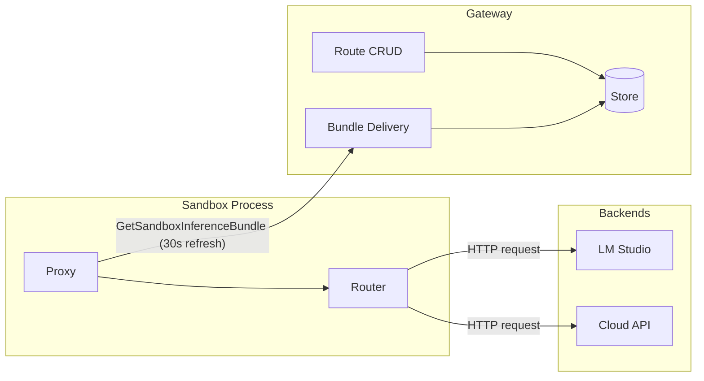
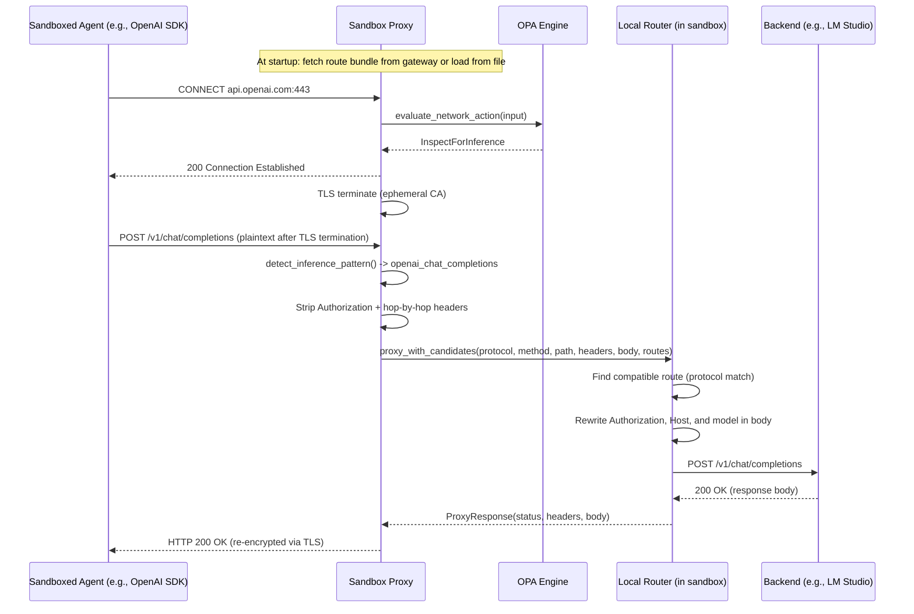
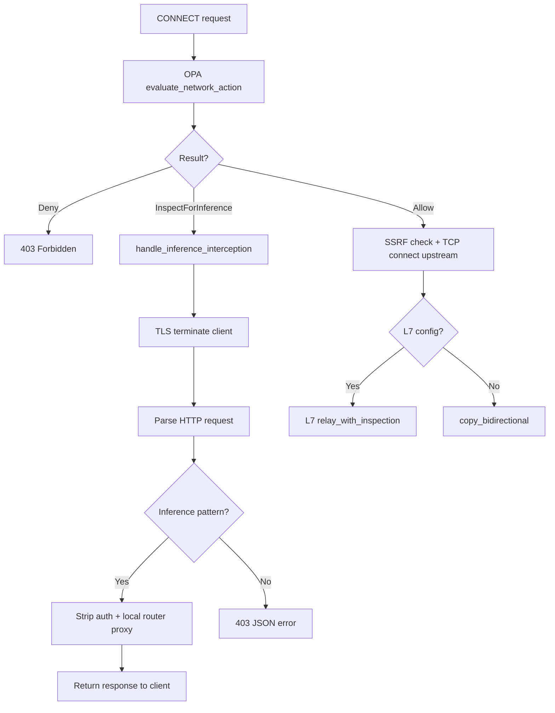

# Inference Routing

The inference routing system transparently intercepts AI inference API calls from sandboxed processes and reroutes them to policy-controlled backends. This allows organizations to redirect SDK calls (OpenAI, Anthropic) to local or self-hosted inference servers without modifying the agent's code. The routing decision and HTTP proxying execute inside the sandbox process itself. The gateway serves only as a control plane for route management and bundle delivery.

## Source File Index

| File | Purpose |
|------|---------|
| `crates/navigator-sandbox/src/l7/inference.rs` | `InferenceApiPattern`, `detect_inference_pattern()`, HTTP request/response parsing for intercepted connections |
| `crates/navigator-sandbox/src/proxy.rs` | `InferenceContext`, `handle_inference_interception()`, `route_inference_request()` -- proxy-side interception and local routing |
| `crates/navigator-sandbox/src/lib.rs` | `build_inference_context()`, `bundle_to_resolved_routes()`, `spawn_route_refresh()` -- route loading and background cache refresh |
| `crates/navigator-sandbox/src/grpc_client.rs` | `fetch_inference_bundle()` -- fetches the pre-filtered route bundle from the gateway |
| `crates/navigator-sandbox/src/opa.rs` | `NetworkAction` enum, `evaluate_network_action()` -- tri-state routing decision |
| `crates/navigator-router/src/lib.rs` | `Router` -- protocol-based route selection and request forwarding |
| `crates/navigator-router/src/backend.rs` | `proxy_to_backend()` -- HTTP request forwarding with auth header and model ID rewriting |
| `crates/navigator-router/src/config.rs` | `RouterConfig`, `RouteConfig`, `ResolvedRoute` -- route configuration types and YAML loading |
| `crates/navigator-router/src/mock.rs` | Mock route support (`mock://` scheme) for testing |
| `crates/navigator-server/src/inference.rs` | `InferenceService` gRPC implementation -- route CRUD and bundle delivery (control plane only) |
| `crates/navigator-core/src/inference.rs` | `normalize_protocols()` -- shared protocol normalization logic |
| `proto/inference.proto` | Protobuf definitions: `InferenceRoute`, `InferenceRouteSpec`, `GetSandboxInferenceBundle` RPC, CRUD RPCs |
| `proto/sandbox.proto` | `InferencePolicy` message (field on `SandboxPolicy`) |
| `crates/navigator-sandbox/src/main.rs` | Sandbox binary CLI: `--inference-routes` / `NEMOCLAW_INFERENCE_ROUTES` flag definition |
| `build/ci.toml` | `[sandbox]` task: mounts `inference-routes.yaml`, sets env vars for dev sandbox |
| `inference-routes.yaml` | Default standalone routes for dev sandbox (NVIDIA API endpoint) |
| `dev-sandbox-policy.rego` | `network_action` Rego rule -- tri-state decision logic |

## Architecture Overview

Inference routing executes in two distinct planes:

- **Control plane (gateway)**: Stores routes in its database, resolves which routes a sandbox is allowed to use based on its policy, and delivers pre-filtered bundles to sandboxes via `GetSandboxInferenceBundle`.
- **Data plane (sandbox)**: Intercepts CONNECT requests, TLS-terminates connections, detects inference API patterns, selects a compatible route from its local cache, and forwards the HTTP request directly to the backend.

The `navigator-router` crate is a dependency of the sandbox, not the server. The server has no `Router` instance and does not execute inference requests.



## End-to-End Flow

An inference routing request passes through four components: the sandboxed agent, the sandbox proxy (with its embedded router), the OPA engine, and the backend. The gateway is involved only at startup and during periodic cache refreshes.



## Route Loading

Routes reach the sandbox through one of two modes, determined at sandbox startup.

### Two Route Source Modes

**File:** `crates/navigator-sandbox/src/lib.rs` -- `build_inference_context()`

The `build_inference_context()` function determines the route source. Priority order:

1. **Standalone mode (route file)**: If `--inference-routes` (or `NEMOCLAW_INFERENCE_ROUTES`) is set, routes load from a YAML file via `RouterConfig::load_from_file()`. The file format matches the `navigator-router` `RouterConfig` schema. This mode always takes precedence -- if both a route file and cluster credentials are present, the route file wins.

2. **Cluster mode (gateway bundle)**: If `sandbox_id` and `navigator_endpoint` are available (and no route file is set), the sandbox fetches a pre-filtered bundle from the gateway via `grpc_client::fetch_inference_bundle()`, which calls the `GetSandboxInferenceBundle` gRPC RPC.

3. **Disabled**: If neither source is configured, `build_inference_context()` returns `None` and inference routing is not active.

### Standalone Mode: YAML Route File

**File:** `crates/navigator-router/src/config.rs`

Routes are defined in a YAML file with this schema:

```yaml
routes:
  - routing_hint: local
    endpoint: http://localhost:1234/v1
    model: meta/llama-3.1-8b-instruct
    protocols: [openai_chat_completions]
    api_key: lm-studio
    # api_key_env: MY_API_KEY   # alternative: read key from environment variable
```

`RouteConfig` supports two key-resolution modes: `api_key` (literal value) and `api_key_env` (environment variable name). If neither is set, route resolution fails at startup. The route file is loaded once at startup; changes require a sandbox restart.

### Cluster Mode: Gateway Bundle

**File:** `crates/navigator-sandbox/src/grpc_client.rs` -- `fetch_inference_bundle()`

The sandbox connects to the gateway's `Inference` gRPC service using mTLS and calls `GetSandboxInferenceBundle` with its `sandbox_id`. The gateway resolves the sandbox's inference policy, filters routes by `allowed_routes`, and returns a `GetSandboxInferenceBundleResponse` containing:

- `routes`: A list of `SandboxResolvedRoute` messages (routing_hint, base_url, protocols, api_key, model_id)
- `revision`: An opaque hash (DefaultHasher-based, 16-char hex) for cache freshness
- `generated_at_ms`: Bundle generation timestamp

The proto response is converted to `Vec<ResolvedRoute>` by `bundle_to_resolved_routes()` in `lib.rs`.

### Background Route Cache Refresh

**File:** `crates/navigator-sandbox/src/lib.rs` -- `spawn_route_refresh()`

In cluster mode, a background `tokio::spawn` task refreshes the route cache every 30 seconds by calling `fetch_inference_bundle()` again. The routes are stored behind `Arc<RwLock<Vec<ResolvedRoute>>>`, shared between the proxy and the refresh task. The refresh task is started even when the initial cluster bundle is empty, so newly created routes become available without restarting the sandbox. If a refresh fails, the sandbox logs a warning and keeps the stale routes.

File mode does not spawn a refresh task -- routes are static for the sandbox lifetime.

### Graceful Degradation

Both route source modes degrade gracefully when routes are unavailable:

- **Empty routes in file mode**: If `routes: []` in the file, `build_inference_context()` returns `None` and inference routing is disabled. This is confirmed by the `build_inference_context_empty_route_file_returns_none` test.
- **Empty routes in cluster mode**: If the initial cluster bundle has zero routes, the sandbox still creates `InferenceContext` with an empty cache and starts background refresh. Intercepted inference requests return `503` (`{"error": "inference endpoint detected without matching inference route"}`) until a later refresh provides routes.
- **Cluster mode errors**: `PermissionDenied` or `NotFound` errors (detected via string matching on the gRPC error message) indicate no inference policy is configured for this sandbox. The sandbox logs this and proceeds without inference routing. Other gRPC errors also result in graceful degradation: inference routing is disabled, but the sandbox starts normally.
- **File mode errors**: Parse failures or missing files in standalone mode are fatal -- `build_inference_context()` propagates the error and the sandbox refuses to start. Only an empty-but-valid routes list is gracefully disabled.

## Tri-State Network Decision

The OPA engine evaluates every CONNECT request and returns one of three routing actions via the `network_action` rule. This replaces the binary allow/deny model with a third option that triggers inference interception.

### `NetworkAction` enum

**File:** `crates/navigator-sandbox/src/opa.rs`

```rust
pub enum NetworkAction {
    Allow { matched_policy: Option<String> },
    InspectForInference { matched_policy: Option<String> },
    Deny { reason: String },
}
```

### Decision logic

The `evaluate_network_action()` method evaluates `data.navigator.sandbox.network_action` and maps the string result:

| Rego result | Rust variant | Meaning |
|-------------|--------------|---------|
| `"allow"` | `NetworkAction::Allow` | Endpoint + binary explicitly matched a `network_policies` entry |
| `"inspect_for_inference"` | `NetworkAction::InspectForInference` | No policy match, but `data.inference.allowed_routes` is non-empty |
| `"deny"` (default) | `NetworkAction::Deny` | No match and no inference routing configured |

### Rego rules

**File:** `dev-sandbox-policy.rego`

```rego
default network_action := "deny"

# Explicitly allowed: endpoint + binary match in a network policy.
network_action := "allow" if {
    network_policy_for_request
}

# Binary not explicitly allowed + inference configured -> inspect.
network_action := "inspect_for_inference" if {
    not network_policy_for_request
    count(data.inference.allowed_routes) > 0
}
```

The `inspect_for_inference` rule fires when the connection does not match any network policy but the sandbox has at least one configured inference route. This covers both unknown endpoints (e.g., `api.openai.com` not in any policy) and known endpoints where the calling binary is not in the allowed list.

## Inference API Pattern Detection

**File:** `crates/navigator-sandbox/src/l7/inference.rs`

The `InferenceApiPattern` struct defines method + path combinations that identify inference API calls. `default_patterns()` returns the built-in set:

| Method | Path | Protocol | Kind |
|--------|------|----------|------|
| `POST` | `/v1/chat/completions` | `openai_chat_completions` | `chat_completion` |
| `POST` | `/v1/completions` | `openai_completions` | `completion` |
| `POST` | `/v1/responses` | `openai_responses` | `responses` |
| `POST` | `/v1/messages` | `anthropic_messages` | `messages` |

`detect_inference_pattern()` strips query strings before matching (splitting on `?`). Matching is method-case-insensitive and path-exact -- no glob patterns. Only the path portion (before `?`) is compared against `path_glob`.

```rust
pub fn detect_inference_pattern<'a>(
    method: &str,
    path: &str,
    patterns: &'a [InferenceApiPattern],
) -> Option<&'a InferenceApiPattern> {
    let path_only = path.split('?').next().unwrap_or(path);
    patterns
        .iter()
        .find(|p| method.eq_ignore_ascii_case(&p.method) && path_only == p.path_glob)
}
```

## Proxy-Side Interception

**File:** `crates/navigator-sandbox/src/proxy.rs`

When OPA returns `InspectForInference`, the proxy calls `handle_inference_interception()` instead of connecting to the upstream server. The proxy never establishes a connection to the original target.

### `InferenceContext`

```rust
pub struct InferenceContext {
    pub patterns: Vec<crate::l7::inference::InferenceApiPattern>,
    router: navigator_router::Router,
    routes: Arc<tokio::sync::RwLock<Vec<navigator_router::config::ResolvedRoute>>>,
}
```

Built at sandbox startup in `crates/navigator-sandbox/src/lib.rs` by `build_inference_context()`. Contains a `Router` (reqwest HTTP client) and a shared route cache. The `route_cache()` method exposes the `Arc<RwLock<...>>` handle for the background refresh task.

### `handle_inference_interception()` flow

1. **Validate prerequisites**: Both `InferenceContext` (router + routes) and `ProxyTlsState` (ephemeral CA) must be present. Missing either is a fatal error for the connection.

2. **TLS-terminate the client**: Call `tls_terminate_client()` to present an ephemeral leaf certificate for the original target host (e.g., `api.openai.com`). The sandboxed SDK sees a valid TLS connection via the sandbox CA that was injected into its trust store at startup.

3. **Read HTTP requests in a loop** (supports HTTP keep-alive):
   - Start with a 64 KiB buffer (`INITIAL_INFERENCE_BUF = 65536`). If the buffer fills before a complete request is parsed, it doubles in size up to 10 MiB (`MAX_INFERENCE_BUF`). Exceeding 10 MiB returns a `413 Payload Too Large` response.
   - Parse the request using `try_parse_http_request()` which extracts method, path, headers, and body. Both `Content-Length` and `Transfer-Encoding: chunked` request framing are supported (chunked bodies are decoded before forwarding).

4. **For each parsed request** (delegated to `route_inference_request()`):
   - If `detect_inference_pattern()` matches:
     - Strip credential and framing/hop-by-hop headers (`Authorization`, `x-api-key`, `host`, `content-length`, and all hop-by-hop headers)
     - Acquire a read lock on the route cache
      - If routes are empty, return `503` JSON: `{"error": "inference endpoint detected without matching inference route"}`
     - Call `Router::proxy_with_candidates()` to select a route and forward the request locally
     - Return the backend's response to the client (response hop-by-hop and framing headers are stripped before formatting)
   - If no pattern matches:
      - Return a `403` JSON error: `{"error": "connection not allowed by policy"}`
   - If the router call fails:
     - Map the `RouterError` to an HTTP status via `router_error_to_http()` and return a JSON error

5. **Shift the buffer** for the next request (supports pipelining within the connection).

### Router error mapping

`router_error_to_http()` translates `RouterError` variants to HTTP status codes:

| `RouterError` variant | HTTP status | Example message |
|----------------------|-------------|-----------------|
| `RouteNotFound` | 400 | "no route configured for routing_hint 'local'" |
| `NoCompatibleRoute` | 400 | "no compatible route for source protocol 'openai_chat_completions'" |
| `Unauthorized` | 401 | (error message) |
| `UpstreamUnavailable` | 503 | "request to ... timed out" |
| `UpstreamProtocol` / `Internal` | 502 | (error message) |

### Integration with the proxy decision flow

The interception path branches from `handle_tcp_connection()` after OPA evaluation:



## Gateway: Bundle Delivery

**File:** `crates/navigator-server/src/inference.rs`

The gateway's `InferenceService` implements the `Inference` gRPC service. It handles route CRUD operations and bundle delivery. It does not hold a `Router` instance and does not execute inference requests.

### GetSandboxInferenceBundle RPC

The entry point for sandbox route loading. Processes requests from sandbox processes at startup and during periodic refresh.

1. **Validate** `sandbox_id` is present (else `INVALID_ARGUMENT`).

2. **Load the sandbox** from the store via `get_message::<Sandbox>()`. Returns `NOT_FOUND` if the sandbox does not exist.

3. **Extract the inference policy**: Navigate `sandbox.spec.policy.inference`. If the `inference` field is absent, return `PERMISSION_DENIED` ("sandbox has no inference policy configured"). If `allowed_routes` is empty, return `PERMISSION_DENIED` ("sandbox inference policy has no allowed routes").

4. **Resolve routes** via `list_sandbox_routes()`:
   - Fetch all `InferenceRoute` records from the store (up to 500)
   - Decode each from protobuf
   - Filter: `enabled == true` AND `routing_hint` is in `allowed_routes` (uses a `HashSet` for O(1) lookup)
   - Normalize and deduplicate protocols per route
   - Skip routes with no valid protocols after normalization
   - Return `Vec<SandboxResolvedRoute>`

5. **Compute revision**: Hash all route fields (routing_hint, base_url, model_id, api_key, protocols) with `DefaultHasher` and format as 16-char hex. This allows sandboxes to detect stale bundles.

6. **Return the response**: `GetSandboxInferenceBundleResponse` with routes, revision, and `generated_at_ms` timestamp.

### Route CRUD RPCs

| RPC | Behavior |
|-----|----------|
| `CreateInferenceRoute` | Validates spec, normalizes protocols (lowercase + dedupe), auto-generates name if empty (via `generate_name()`), checks for name uniqueness, assigns UUID, persists |
| `UpdateInferenceRoute` | Looks up existing route by name, preserves the stored `id`, replaces the spec |
| `DeleteInferenceRoute` | Deletes by name via `delete_by_name()`, returns `deleted: bool` |
| `ListInferenceRoutes` | Paginated list (default limit 100), decodes protobuf from store records |

### Route validation

`validate_route_spec()` checks that required fields are non-empty:

- `routing_hint` -- the label that sandbox policies reference
- `base_url` -- backend endpoint URL
- `protocols` -- at least one protocol after normalization
- `model_id` -- model identifier to use

Note: `api_key` is not validated as required on the server side. Routes can be stored with an empty `api_key`, which is valid for local backends that do not require authentication. The `api_key` defaults to empty string in the CLI (`--api-key`, default `""`).

### Protocol normalization

`normalize_protocols()` (in `crates/navigator-core/src/inference.rs`) transforms the protocol list: trim whitespace, convert to lowercase, remove duplicates (preserving insertion order), remove empty entries. This function is shared between the server and router crates.

## Inference Router

**File:** `crates/navigator-router/src/lib.rs`

The `Router` struct holds a `reqwest::Client` with a 60-second timeout and an optional set of static routes (used for config-file-based routing via `Router::from_config()`).

### Route selection

`proxy_with_candidates()` takes a `source_protocol` (e.g., `"openai_chat_completions"`) and an externally-provided list of `ResolvedRoute` candidates. It:

1. Normalizes `source_protocol` to lowercase.
2. Finds the **first** candidate whose `protocols` list contains an exact match.
3. Returns `NoCompatibleRoute` if no candidate matches.

```rust
let route = candidates
    .iter()
    .find(|r| r.protocols.iter().any(|p| p == &normalized_source))
    .ok_or_else(|| RouterError::NoCompatibleRoute(source_protocol.to_string()))?;
```

### Mock route support

**File:** `crates/navigator-router/src/mock.rs`

Routes with a `mock://` endpoint scheme return canned responses without making HTTP calls. Mock responses are protocol-aware:

| Protocol | Response shape |
|----------|---------------|
| `openai_chat_completions` | Valid OpenAI chat completion JSON |
| `openai_completions` | Valid OpenAI text completion JSON |
| `anthropic_messages` | Valid Anthropic messages JSON |
| Other | Generic JSON with `mock: true` |

All mock responses include an `x-navigator-mock: true` header and use the route's `model` field in the response body.

### Backend proxying

**File:** `crates/navigator-router/src/backend.rs`

`proxy_to_backend()` forwards the HTTP request to the real backend:

1. **Construct URL**: `{route.endpoint.trim_end('/')}{path}` (e.g., `http://localhost:1234/v1` + `/chat/completions` = `http://localhost:1234/v1/chat/completions`). Note: the path from the original request is appended as-is. If the route's `base_url` already includes the API prefix, the path may double up -- route configuration should account for this.

2. **Set Authorization**: `Bearer {route.api_key}` via `builder.bearer_auth()`.

3. **Forward headers**: All headers except `authorization` and `host` are forwarded from the original request.

4. **Model ID rewrite**: If the request body is valid JSON containing a `"model"` key, the value is replaced with `route.model`. This ensures the backend receives the model ID it serves, not the client's original model alias. If the body is not JSON or has no `"model"` key, it is forwarded unchanged.

5. **Timeout**: 60 seconds (set at `Client` construction time).

6. **Error classification**:

| Condition | Error variant |
|-----------|--------------|
| Request timeout | `RouterError::UpstreamUnavailable` |
| Connection failure | `RouterError::UpstreamUnavailable` |
| Response body read failure | `RouterError::UpstreamProtocol` |
| Invalid HTTP method | `RouterError::Internal` |
| Other request errors | `RouterError::Internal` |

## Data Model

### InferenceRoute (protobuf)

**File:** `proto/inference.proto`

```protobuf
message InferenceRoute {
  string id = 1;              // UUID, assigned at creation
  InferenceRouteSpec spec = 2;
  string name = 3;            // Human-friendly, unique per object type
}

message InferenceRouteSpec {
  string routing_hint = 1;    // Label for policy matching (e.g., "local")
  string base_url = 2;        // Backend endpoint URL
  repeated string protocols = 3; // Supported protocols (e.g., ["openai_chat_completions"])
  string api_key = 4;         // API key for the backend (may be empty)
  string model_id = 5;        // Model identifier
  bool enabled = 6;           // Whether route is active
}
```

Persisted in the `objects` table with `object_type = "inference_route"`, using protobuf encoding.

### InferencePolicy (protobuf)

**File:** `proto/sandbox.proto`

```protobuf
message InferencePolicy {
  repeated string allowed_routes = 1; // e.g., ["local", "frontier"]
  repeated InferenceApiPattern api_patterns = 2; // Custom patterns (unused, defaults apply)
}
```

A field on `SandboxPolicy`, referenced by the OPA engine as `data.inference.allowed_routes`.

The `api_patterns` field is intended to allow per-sandbox pattern customization. The sandbox code does not currently read this field -- it always calls `default_patterns()` from `crates/navigator-sandbox/src/l7/inference.rs`. The proto comment notes: "If empty, built-in defaults (OpenAI chat/completions) are used."

### SandboxResolvedRoute (protobuf)

**File:** `proto/inference.proto`

```protobuf
message SandboxResolvedRoute {
  string routing_hint = 1;
  string base_url = 2;
  repeated string protocols = 3;
  string api_key = 4;
  string model_id = 5;
}
```

Returned by `GetSandboxInferenceBundle`. Contains the fields needed for routing -- the gateway pre-filters routes so the sandbox receives only those matching its policy.

### GetSandboxInferenceBundle (protobuf)

**File:** `proto/inference.proto`

```protobuf
message GetSandboxInferenceBundleRequest {
  string sandbox_id = 1;
}

message GetSandboxInferenceBundleResponse {
  repeated SandboxResolvedRoute routes = 1;
  string revision = 2;           // Opaque hash for cache freshness
  int64 generated_at_ms = 3;     // Epoch ms when bundle was generated
}
```

### ResolvedRoute (Rust)

**File:** `crates/navigator-router/src/config.rs`

```rust
pub struct ResolvedRoute {
    pub routing_hint: String,
    pub endpoint: String,
    pub model: String,
    pub api_key: String,
    pub protocols: Vec<String>,
}
```

Created either from `RouterConfig::resolve_routes()` (file mode) or `bundle_to_resolved_routes()` (cluster mode). Contains only the fields needed for routing. Implements a custom `Debug` that redacts `api_key` as `[REDACTED]`.

## Policy Configuration

### Sandbox policy (YAML)

The `inference` key in a sandbox policy YAML file controls which routes the sandbox can use:

```yaml
inference:
  allowed_routes:
    - local        # Matches routes with routing_hint "local"
    - frontier     # Matches routes with routing_hint "frontier"
```

When `allowed_routes` is non-empty, the OPA engine returns `inspect_for_inference` for any connection that does not explicitly match a `network_policies` entry. When `allowed_routes` is empty or the `inference` key is absent, unmatched connections are denied.

### Route configuration (file mode)

For standalone sandboxes (no cluster), routes are configured in a YAML file and passed via `--inference-routes` or `NEMOCLAW_INFERENCE_ROUTES`:

```yaml
routes:
  - routing_hint: local
    endpoint: http://localhost:1234/v1
    model: meta/llama-3.1-8b-instruct
    protocols: [openai_chat_completions, openai_responses]
    api_key: lm-studio

  - routing_hint: frontier
    endpoint: https://api.anthropic.com
    model: claude-sonnet-4-20250514
    protocols: [anthropic_messages]
    api_key_env: ANTHROPIC_API_KEY
```

### Route configuration (cluster mode)

Routes are stored in the gateway's database and managed via the `nav inference` CLI commands or the gRPC API:

```
routing_hint: local
base_url: http://localhost:1234/v1
protocols: [openai_chat_completions]
api_key: lm-studio
model_id: meta/llama-3.1-8b-instruct
enabled: true
```

The `routing_hint` field connects sandbox policy to server-side routes: a sandbox with `allowed_routes: ["local"]` can use any enabled route whose `routing_hint` is `"local"`.

## CLI Commands

**File:** `crates/navigator-cli/src/main.rs` (command definitions), `crates/navigator-cli/src/run.rs` (implementations)

| Command | Description |
|---------|-------------|
| `nav inference create` | Create an inference route. Accepts `--routing-hint`, `--base-url`, `--protocol` (repeatable or comma-separated), `--api-key` (default empty), `--model-id`, `--disabled`. Auto-generates a name unless `--name` is provided. |
| `nav inference update` | Update an existing route by name. Same flags as create. |
| `nav inference delete` | Delete one or more routes by name. |
| `nav inference list` | List all routes. Supports `--limit` (default 100) and `--offset`. |

The `create` and `update` commands perform protocol auto-detection when `--protocol` is not specified: they probe the backend URL with the provided API key and model to determine supported protocols, showing a spinner during the process.

## Dev Sandbox Workflow

**File:** `build/ci.toml` (task `[sandbox]`), `inference-routes.yaml` (repo root)

Running `mise run sandbox` starts a standalone sandbox container with inference routing pre-configured. The task mounts three files into the container:

- `dev-sandbox-policy.rego` as `/var/navigator/policy.rego`
- `dev-sandbox-policy.yaml` as `/var/navigator/data.yaml`
- `inference-routes.yaml` as `/var/navigator/inference-routes.yaml`

The container receives `NEMOCLAW_INFERENCE_ROUTES=/var/navigator/inference-routes.yaml` to enable standalone inference routing. `NVIDIA_API_KEY` is always forwarded from the host environment (empty string if unset).

The default `inference-routes.yaml` defines a single route:

```yaml
routes:
  - routing_hint: local
    endpoint: https://integrate.api.nvidia.com/
    model: nvidia/nemotron-3-nano-30b-a3b
    protocols:
      - openai_chat_completions
      - openai_completions
    api_key_env: NVIDIA_API_KEY
```

The `-e` flag forwards arbitrary host environment variables into the container:

```bash
mise run sandbox -e ANTHROPIC_API_KEY -- /bin/bash
```

This checks whether the named variable is set in the host environment and passes it through. Unset variables produce a warning and are skipped.

## Security: API Key Handling

The migration moves API keys from the gateway's memory into each sandbox's memory. This changes the blast radius of a sandbox compromise.

### Previous model

API keys lived only in the gateway's database and process memory. Sandboxes sent inference requests to the gateway via gRPC; the gateway looked up routes, injected the API key, and forwarded to the backend. A compromised sandbox could use the gateway as an oracle to make inference calls but could not extract the raw API key.

### Current model

API keys are delivered to the sandbox in the route bundle (`SandboxResolvedRoute.api_key`) and held in `ResolvedRoute` structs within sandbox memory. The sandbox's `Router` injects the key directly when forwarding to backends. A compromised sandbox can read its own memory and extract the keys.

### Mitigations

1. **Scoped bundles**: The gateway filters routes by the sandbox's `allowed_routes` policy before delivering the bundle. A sandbox only receives keys for routes it is authorized to use.

2. **Custom Debug redaction**: `ResolvedRoute` implements `Debug` with `api_key` rendered as `[REDACTED]`. This prevents keys from leaking into logs or debug output.

3. **No child process injection**: API keys are not injected into the entrypoint process's environment or into SSH shell environments. They exist only within the Rust proxy/router structures in the sandbox supervisor process.

4. **Landlock and seccomp**: The sandboxed child process runs under Landlock and seccomp restrictions that prevent it from reading the supervisor's memory (the supervisor runs outside the sandbox namespace).

## Deployment: Hard Cutover

The inference routing migration is a breaking protocol change. The `ProxyInference` RPC has been removed from the proto definition and the gateway no longer implements it. Sandboxes running the new code call `GetSandboxInferenceBundle` instead.

**Deployment requirements:**
- Server and sandbox must be released together.
- Running sandboxes must be restarted after the upgrade -- they cannot be live-migrated.
- There is no backward-compatible fallback period. Old sandboxes calling the removed `ProxyInference` RPC will get `UNIMPLEMENTED` errors from the updated gateway.

## Error Handling

### Proxy-side errors

| Condition | Behavior |
|-----------|----------|
| `InferenceContext` missing | Error: "InspectForInference requires inference context (router + routes)" |
| TLS state not configured | Error: "InspectForInference requires TLS state for client termination" |
| Request exceeds 10 MiB buffer | `413` Payload Too Large response to client |
| Non-inference request on intercepted connection | `403` JSON error: `{"error": "connection not allowed by policy"}` |
| No routes in cache | `503` JSON error: `{"error": "inference endpoint detected without matching inference route"}` |
| Router returns `NoCompatibleRoute` | `400` JSON error |
| Backend timeout or connection failure | `503` JSON error |
| Backend protocol error or internal error | `502` JSON error |

### Gateway-side errors (bundle delivery)

| Condition | gRPC status |
|-----------|-------------|
| Empty `sandbox_id` | `INVALID_ARGUMENT` |
| Sandbox not found | `NOT_FOUND` |
| Sandbox has no inference policy | `PERMISSION_DENIED` |
| Inference policy has empty `allowed_routes` | `PERMISSION_DENIED` |
| Store read failure | `INTERNAL` |

### Router-side errors

| Condition | `RouterError` variant | HTTP status (via proxy) |
|-----------|----------------------|------------------------|
| No compatible route for protocol | `NoCompatibleRoute` | 400 |
| Backend timeout (60s) | `UpstreamUnavailable` | 503 |
| Backend connection failure | `UpstreamUnavailable` | 503 |
| Response body read failure | `UpstreamProtocol` | 502 |
| Invalid HTTP method | `Internal` | 502 |

## Cross-References

- [Sandbox Architecture](sandbox.md) -- Proxy, OPA engine, TLS termination, `NetworkAction` integration
- [Gateway Architecture](gateway.md) -- gRPC service hosting, `ServerState`, persistence store
- [Policy Language](security-policy.md) -- Rego rules including `network_action`
- [Overview](README.md) -- System-wide context
